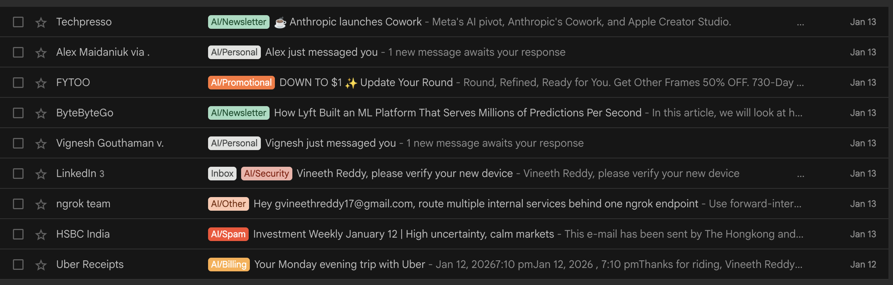
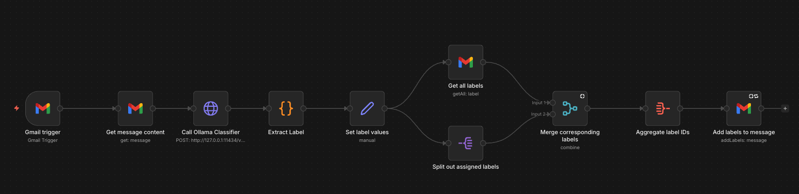
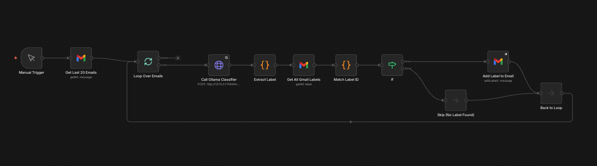

# We fine-tuned an email classification model so you can auto-label your emails locally with n8n.


We built a fully local Gmail auto-labeler with n8n + a fine-tuned 0.6B model (no email content sent to cloud LLMs)

Most of our inboxes are a mix of useful and distracting. Labels can help making order from the chaos - but labelling all emails manually takes time too.

We put together a setup that auto-labels Gmail **locally**, so email content does not go to external LLM APIs.



### What it does (end-to-end local):

- n8n trigger when you receive an email
- It sends the email text (subject + snippet/body) to a fine-tuned model running on localhost via Ollama
- It applies the predicted label back in Gmail (we recommend prefixing labels with AI/)

#### Label set (10-way closed set):
Billing, Newsletter, Work, Personal, Promotional, Security, Shipping, Travel, Spam, Other

### Results:

| Model | Accuracy |
| --- | --- |
| Teacher (GPT-OSS-120B) | 93% |
| Base student (Qwen3-0.6B) | 38% |
| Fine-tuned student (Qwen3-0.6B) | 93% |

### Traning setup 

| Student model | Qwen3-0.6B (600M parameters) |
| --- | --- |
| Teacher model | GPT-OSS-120B |
| Training method | Knowledge distillation + supervised fine-tuning (SFT) |
| Seed data | 154 examples |
| Training data | 10,000 synthetic email examples across 10 categories generated using our data synthesis pipeline |

## **System Setup**

**Installation Steps:**

1. **Install n8n locally**

```bash
# Install Node.js (if not installed)
brew install node

# Install n8n globally
npm install -g n8n

# Start n8n
n8n
```

Access n8n at: [**http://localhost:5678**](http://localhost:5678/)

2. **Download the model**

```bash
#install huggingface CLI if not instlalled 
python3 -m pip install -U huggingface_hub

#download the model
hf download distil-labs/distil-email-classifier --local-dir ./distil-email-classifier
```

3. **Run the model**

```bash
#install Ollama or you can download from https://ollama.com/download
brew install ollama 

#start Ollama
ollama serve

#navigate to your model folder
cd ./distil-email-classifier

#create model in ollama 
ollama create email-classifier -f Modelfile

#verify the model is created or not 
ollama list

#run the model
ollama run email-classifier "test"

#check the model is running or not
ollama ps

Expected output:

NAME                       ID              SIZE      PROCESSOR    CONTEXT    UNTIL              
email-classifier:latest    695190b0f07f    3.5 GB    100% GPU     4096       4 minutes from now

#to keep model running forver run the below commands
OLLAMA_KEEP_ALIVE=-1 ollama run email-classifier "test"

Now shows Forever instead of 4 minutes from now.
```

Once you finish the setup, open  n8n in your browser ([**`http://localhost:5678`**](http://localhost:5678/)), sign up with your email, and you get an access code from  n8n for your email, you can update the access code.

### Import n8n workflows

Download the workflow JSON files from our GitHub repository: https://github.com/distil-labs/distil-n8n-gmail-automation

#### Two workflows are available: 

- Real-time Classification: Triggers automatically on each incoming email


- Batch Processing: Classifies multiple existing emails at once
  

To connect your Gmail you need to setup Gmail OAuth (Google cloud console) you can find detailed steps on this on github readme.

Before running the workflow, create all 10 labels manually in your Gmail account. Use the "AI/" prefix to match the model output (AI/Billing, AI/Work, AI/Travel, and so on).

Once this is running, New messages get labeled automatically.

If you want different labels, you can distill a custom version of this classifier on the [distil labs platform](https://www.distillabs.ai/?utm_source=github&utm_medium=referral&utm_campaign=distil-n8n-email-classifier). When you sign up, you get two free training credits to train the model.

Full Write up: [www.distillabs.ai/blog/how-to-label-your-emails-locally-with-a-distil-labs-fine-tuned-model-and-n8n](http://www.distillabs.ai/blog/how-to-label-your-emails-locally-with-a-distil-labs-fine-tuned-model-and-n8n?utm_source=github&utm_medium=referral&utm_campaign=distil-n8n-email-classifier)

workflows: https://github.com/distil-labs/distil-n8n-gmail-automation

Model: https://huggingface.co/distil-labs/distil-email-classifier

## Links

<p align="center">
  <a href="https://www.distillabs.ai/?utm_source=github&utm_medium=referral&utm_campaign=distil-n8n-email-classifier">
    
  </a>
  <a href="https://github.com/distil-labs">
    
  </a>
  <a href="https://huggingface.co/distil-labs">
    
  </a>
  <a href="https://www.linkedin.com/company/distil-labs/">
    
  </a>
  <a href="https://distil-labs-community.slack.com/join/shared_invite/zt-36zqj87le-i3quWUn2bjErRq22xoE58g">
    
  </a>
  <a href="https://x.com/distil_labs">
    
  </a>
</p>


